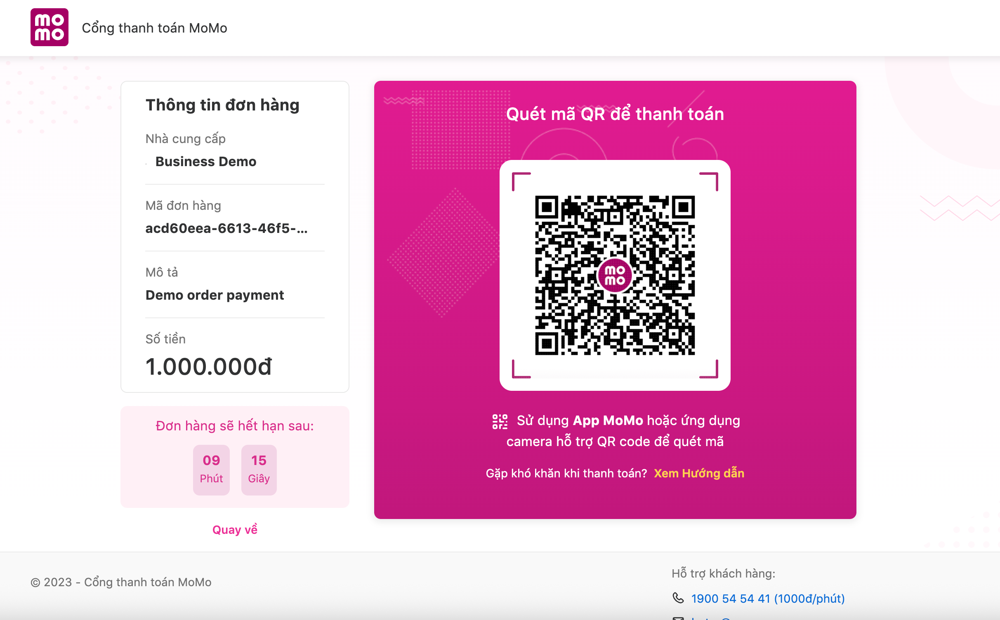

# 🪙 MoMo Payment Gateway Demo (Go)

### Overview
A clean-layer demo project showing how to integrate **MoMo Sandbox (v2.0)** with Go backend and minimal HTML UI.  
Includes full flow: create payment → MoMo pay page → IPN → check-status → update order.

---

### Folder Structure
```
momo-demo/
├── api/               # HTTP routes and handlers (Gin)
├── service/           # Business logic
├── persistence/       # MoMo client, order repo
├── entity/            # Core domain entities
├── model/             # Request/response structs
├── static/            # Frontend pages (index.html, return.html)
└── main.go
```

---

### Flow Diagram
```
User ─▶ /create (backend)
       └─▶ MoMo payUrl ─▶ User pays
              └─▶ MoMo → /ipn (server→server)
                     └─▶ Verify signature & update order (PAID)
              └─▶ Redirect /momo/return
                     └─▶ FE queries /check-status → display result
```

---

### Run Locally
```bash
go run main.go
```
App starts on **http://localhost:8083**

---

### Test Flow
1. Open `http://localhost:8083`  
2. Enter amount + description → click **Pay with MoMo**  
3. Complete payment on MoMo sandbox page  
4. Redirected back to `/momo/return`  
   - It auto calls `/check-status`
   - Updates order via `/update-order`
5. Console logs will show signature verification, payment result, and order update.

---

### IPN Simulation (for localhost)
MoMo sandbox cannot reach localhost directly.  
To test IPN:
```bash
curl -X POST http://localhost:8083/api/v1/payment/momo/ipn   -H "Content-Type: application/json"   -d '{ ... valid IPN payload with correct signature ... }'
```
Alternatively, expose your local server using [ngrok](https://ngrok.com) or Cloudflare Tunnel.
“
---
## 🖼 Result (Payment UI)

After calling `POST /api/v1/payment/momo/create`, the backend signs the request,
calls MoMo's `create` API, and returns `payUrl`.

When you redirect the user to that `payUrl`, MoMo shows the checkout page with
QR code for payment, like this:



- Left panel: order info (merchant, orderId, description, amount).
- Right panel: QR that the user scans in MoMo app.
- Countdown: how long the payment link is still valid.

From here:
1. The user scans and pays.
2. MoMo will call your IPN endpoint (`/api/v1/payment/momo/ipn`).
3. User gets redirected back to `/momo/return?...`.

### Notes
- The UI (`return.html`) automatically queries `/check-status` and updates order accordingly.  
- The IPN endpoint (`/api/v1/payment/momo/ipn`) should **only be called by MoMo**, not from frontend.  
- For real deployment, ensure your `/ipn` URL is publicly accessible (HTTPS).  
- For sandbox testing, you can simulate IPN manually or use a tunnel.

---

### Contact for MoMo Sandbox Keys
💬 **Need sandbox partnerCode, accessKey, or secretKey?**  
Request access via [Hao Pham’s Facebook](https://www.facebook.com/hao.pham.981088/).

### Notes
- **Created by:** Hao Pham
- **Architecture:** Clean modular structure
- **API Sandbox:** [https://test-payment.momo.vn](https://test-payment.momo.vn)

---

🟢 *Goal:* Demonstrate a full-stack MoMo integration flow in Go (signature, redirect, IPN verification, query status).
